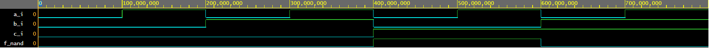
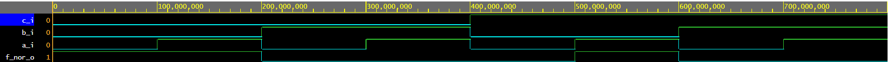
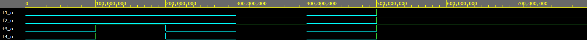

# DeMorganowe zákony - realizacia vo VHDL

**Link na môj EDA PLAYGROUND**

[DEMORGANOWE ZÁKONY](https://www.edaplayground.com/x/YDCa).

## Prvá funkcia
   
**VHDL CODE**

```vhdl
architecture dataflow of gates is
begin
    f_o <=((not b_i) and a_i) or ((not c_i) and (not b_i));
end architecture dataflow;
```


| **c** | **b** |**a** | **f(c,b,a)** |
| :-: | :-: | :-: | :-: |
| 0 | 0 | 0 | 1 |
| 0 | 0 | 1 | 1 |
| 0 | 1 | 0 | 0 |
| 0 | 1 | 1 | 0 |
| 1 | 0 | 0 | 0 |
| 1 | 0 | 1 | 1 |
| 1 | 1 | 0 | 0 |
| 1 | 1 | 1 | 0 |


## Druhá funkcia - NAND

**VHDL CODE**

```vhdl
architecture dataflow of gates is
begin
    f_nand_o <= not (not (not b_i and a_i) and not(not c_i and not b_i));
end architecture dataflow;
```




| **c** | **b** |**a** | **f(c,b,a)** |
| :-: | :-: | :-: | :-: |
| 0 | 0 | 0 | 1 |
| 0 | 0 | 1 | 1 |
| 0 | 1 | 0 | 0 |
| 0 | 1 | 1 | 0 |
| 1 | 0 | 0 | 0 |
| 1 | 0 | 1 | 1 |
| 1 | 1 | 0 | 0 |
| 1 | 1 | 1 | 0 |

## Tretia funkcia - NOR

**VHDL CODE**

```vhdl
architecture dataflow of gates is
begin
    f_nor  <= not(b_i or not a_i) or not (c_i or b_i);
end architecture dataflow;
```




| **c** | **b** |**a** | **f(c,b,a)** |
| :-: | :-: | :-: | :-: |
| 0 | 0 | 0 | 1 |
| 0 | 0 | 1 | 1 |
| 0 | 1 | 0 | 0 |
| 0 | 1 | 1 | 0 |
| 1 | 0 | 0 | 0 |
| 1 | 0 | 1 | 1 |
| 1 | 1 | 0 | 0 |
| 1 | 1 | 1 | 0 |

# Distribučné zákony

**Link na môj EDA PLAYGROUND**

[DISTRIBUČNÉ ZÁKONY](https://www.edaplayground.com/x/WwFg)



*Ako môžeme vidieť z obrázka funckia 1 sa rovná funkcií 2 a funkcia 3 sa rovná funkcii 4 - potvrdili sme distribučné zákony.*


