# Cvičenie 3

## Table with connection of 16 slide switches and 16 LEDs on Nexys A7 board.

| **LED** | **Connection** | **Switch** | **Connection** | 
| :-: | :-: | :-: | :-: |
| LED0 | H17 | SW0 | J15 |
| LED1 | K15 | SW1 | L16 |
| LED2 | J13 | SW2 | M13 |
| LED3 | N14 | SW3 | R15 |
| LED4 | R18 | SW4 | R17 |
| LED5 | V17 | SW5 | T18 |
| LED6 | U17 | SW6 | U18 |
| LED7 | U16 | SW7 | R13 |
| LED8 | V16 | SW8 | T8 |
| LED9 | T15 | SW9 | U8 |
| LED10 | U14 | SW10 | R16 |
| LED11 | T16 | SW11 | T13 |
| LED12 | V15 | SW12 | H6 |
| LED13 | V14 | SW13 | U12 |
| LED14 | V12 | SW14 | U11 |
| LED15 | V11 | SW15 | V10 |

## Two-bit wide 4-to-1 multiplexer


**VHDL ARCHITECTURE CODE**

```vhdl
architecture Behavioral of mux_2bit_4to1 is
begin
   f_O <= a_i when (sel_i ="00") else
          b_i when (sel_i ="01") else
          c_i when (sel_i ="10") else
          d_i when (sel_i ="11");
          
  end architecture Behavioral;
```

**VHDL TESTBENCH**

```vhdl
p_stimulus : process
    begin
        s_d <= "00" ;s_c <="00"; s_b <= "00"; s_a <= "00";
        s_sel <= "00"; wait for 100 ns;
        
        s_d <= "10" ;s_c <="01"; s_b <= "01"; s_a <= "00";
        s_sel <= "00"; wait for 100 ns;
        
        s_d <= "10" ;s_c <="01"; s_b <= "01"; s_a <= "11";
        s_sel <= "00"; wait for 100 ns;
        
        s_d <= "10" ;s_c <="01"; s_b <= "11"; s_a <= "00";
        s_sel <= "01"; wait for 100 ns;
        -- Report a note at the end of stimulus process
        report "Stimulus process finished" severity note;
        wait;
    end process p_stimulus;

end architecture testbench;
```

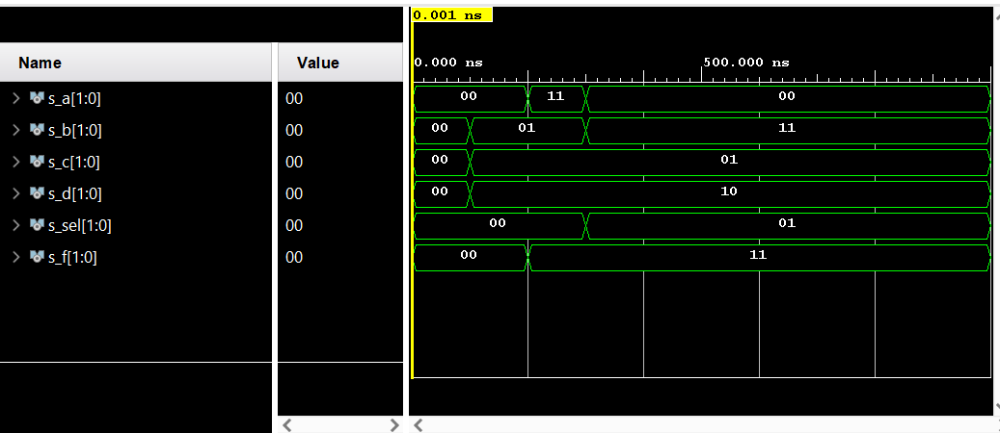

# VIVADO TUTORIAL

## CREATING NEW PROJECT

1.Open Vivado from shortcut or Windows menu.

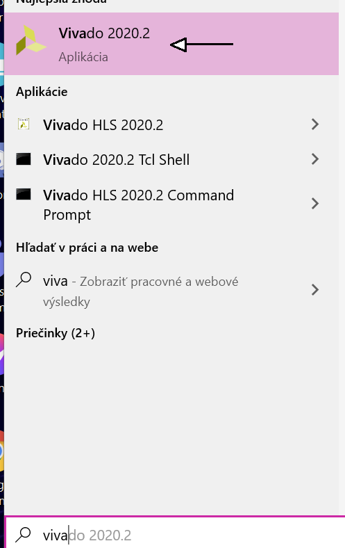

2.Click on Create Project in the Start Menu as shown below.
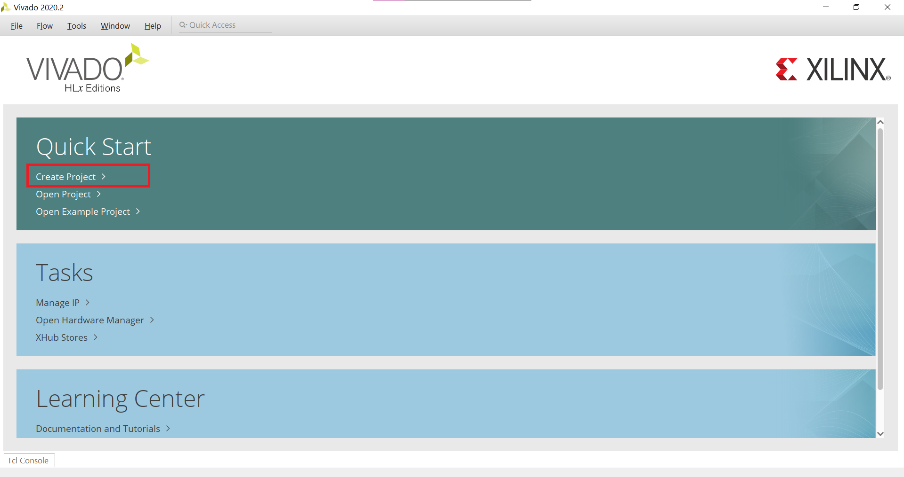 

The new window will pop up.
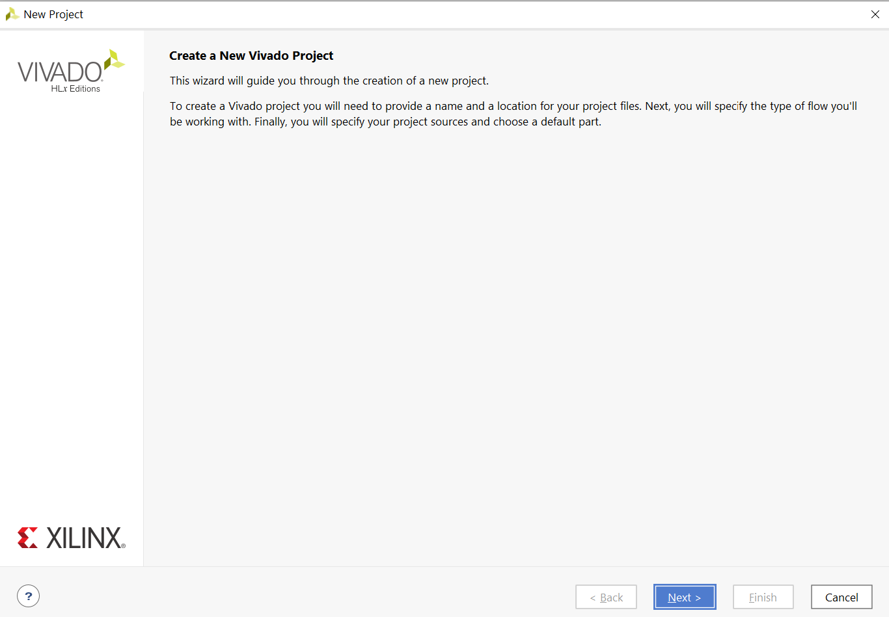

3.Click next and select the project directory and its name.
Don't use spaces or diacritic marks in your project name or directory path.Vivado doesn't allow these things!
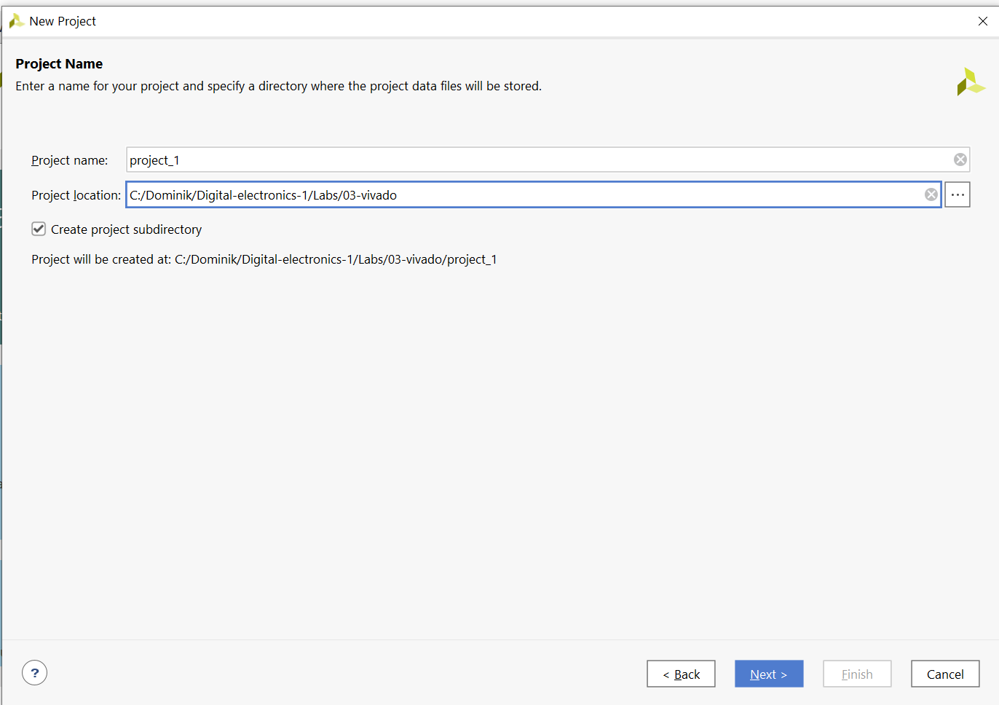

4.Click next and specify the type of project - choose RTL Project.
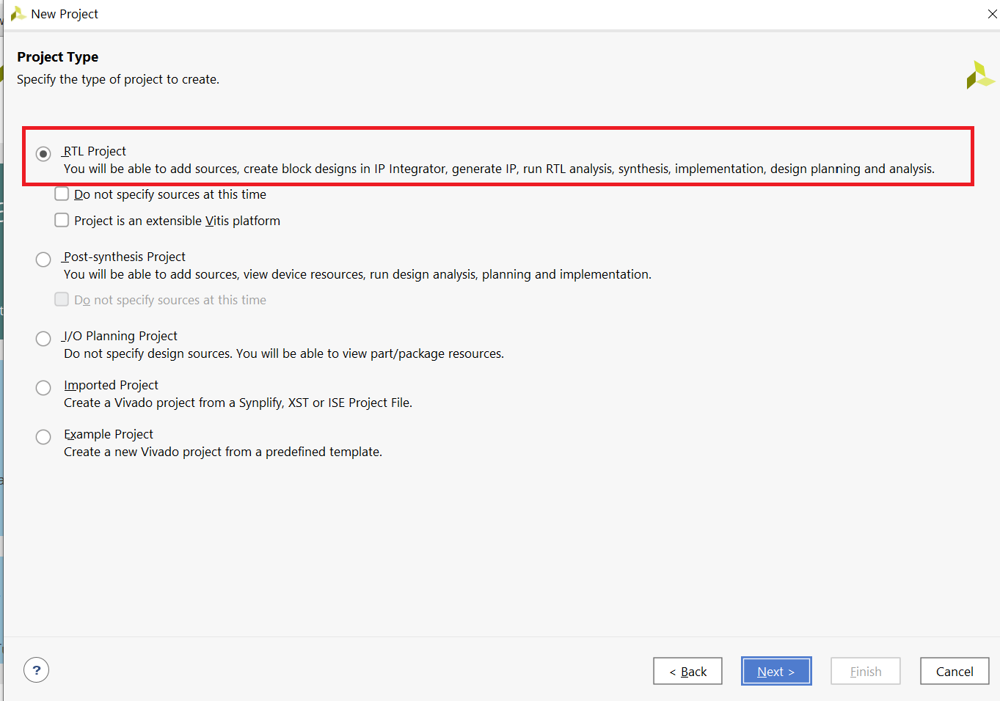

5.Click next and specify target language and simulator language - in this class we are using VHDL.
You don't have to add any sources at this point. We will do it later.
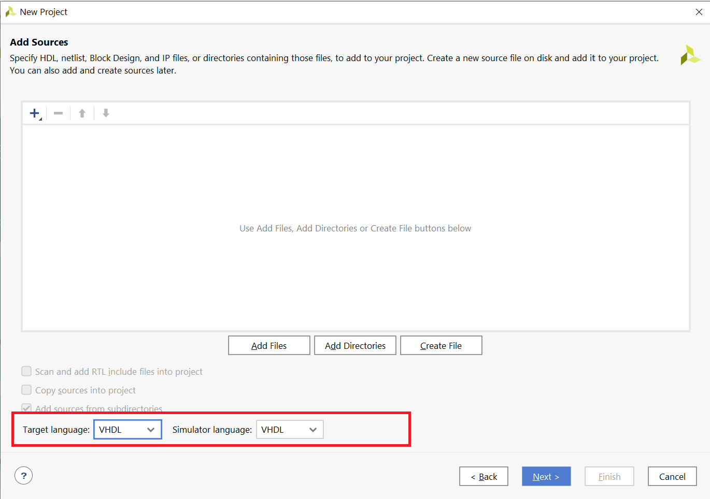

6.Click next,click on board tab and choose board you wanna use - choose Nexys A7-50T.
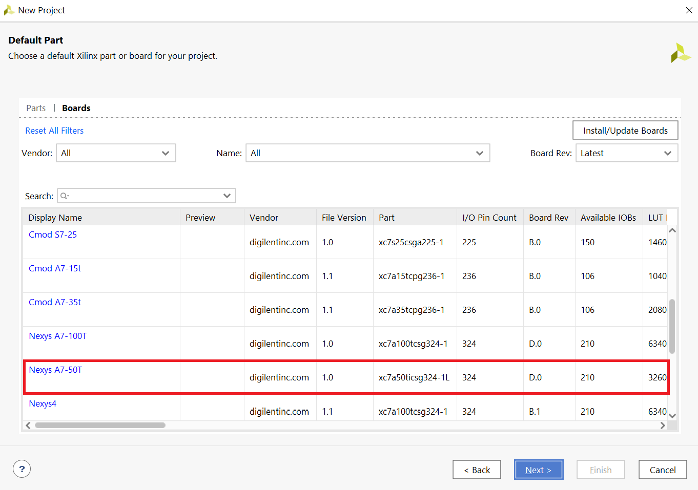

7.Click next,then finish and you should see the window as shown below.
You succesfully created new project!
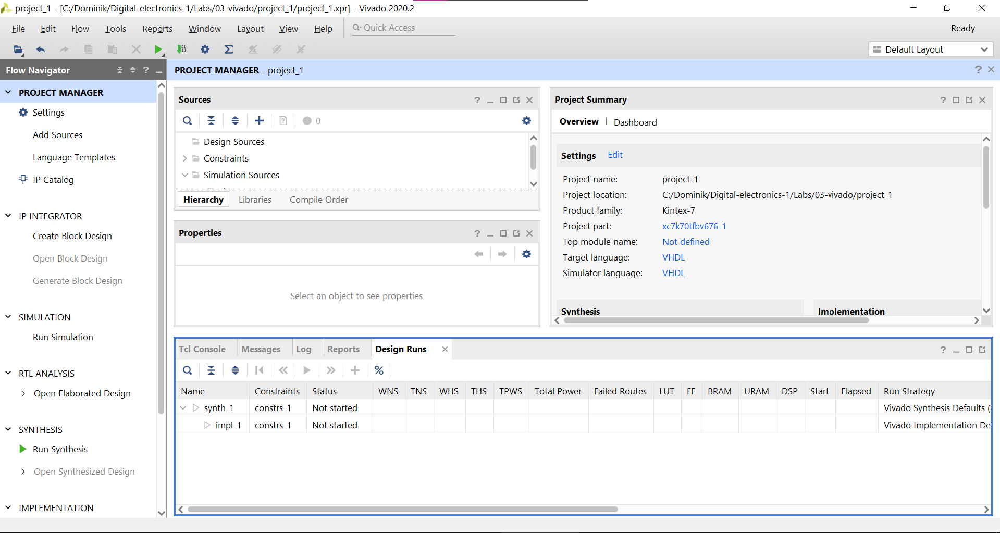

## ADDING DESIGN,TESTBENCH AND XDC FILE

1.Click on add sources as shown below.

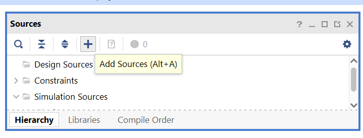

2.Choose "Add or create design sources" and click next.
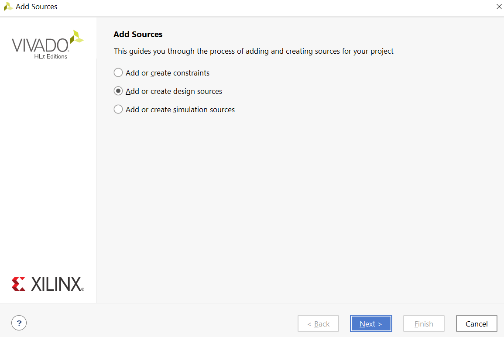

3.Click on create file,enter the name of design file,click ok and then finish.
You succesfully added design file to your project!
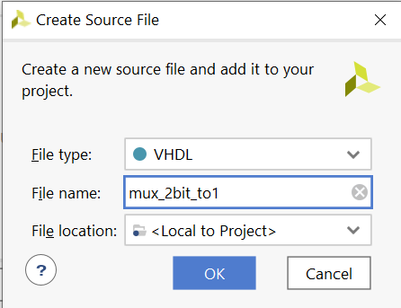

4.For adding testbench file,repeat the steps for adding design file,except when adding source choose "Add or create simulation sources". 
 

5.In choosing name section,enter the same filename as design file with prefix tb_.
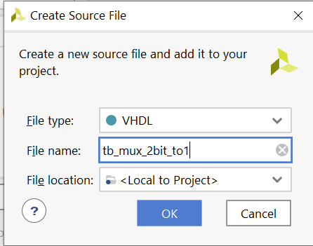 

And you are done.You created new project,added design and testbench files and now you can work on your project.
But sometimes you wanna add constraint file,so lets show you how you can do that.

6.Repeat the same steps as shown before for testbench or design,except in adding source choose "Add or create constraints."
 

7.Enter the name,click finish and you are done!

## RUNNING SIMULATION

1.Click on Flow,then choose run simulation,then run behavioral simulation and wait for about one minute (depends on your computer).
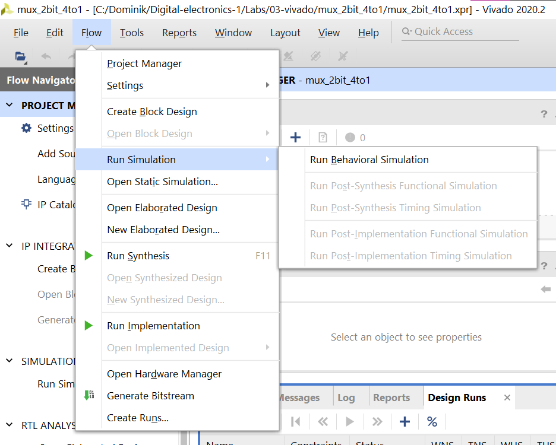
 
2.New window with simulation will pop up and you can enjoy it!