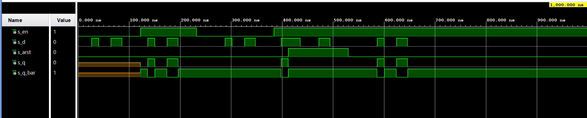
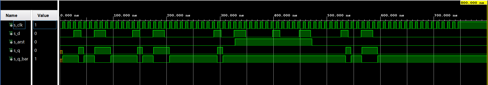
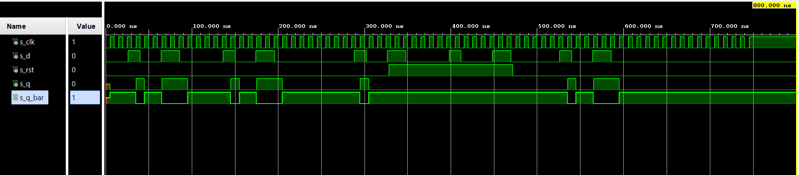
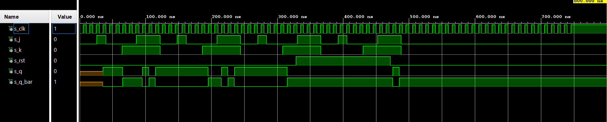
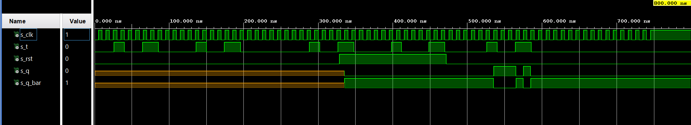

## Cvičenie 7

# PREPARATION TASK

| **D** | **Qn** | **Q(n+1)** | **Comments** |
| :-: | :-: | :-: | :-- |
| 0 | 0 | 0 | No change  |
| 0 | 1 | 0 | Change  |
| 1 | 0 | 1 | Change  |
| 1 | 1 | 1 | No change |

| **J** | **K** | **Qn** | **Q(n+1)** | **Comments** |
| :-: | :-: | :-: | :-: | :-- |
| 0 | 0 | 0 | 0 | No change |
| 0 | 0 | 1 | 1 | No change |
| 0 | 1 | 0 | 0 | Reset |
| 0 | 1 | 1 | 0 | Reset |
| 1 | 0 | 0 | 1 | Set |
| 1 | 0 | 1 | 1 | Set |
| 1 | 1 | 0 | 1 | Toggle |
| 1 | 1 | 1 | 0 | Toggle |

| **T** | **Qn** | **Q(n+1)** | **Comments** |
| :-: | :-: | :-: | :-- |
| 0 | 0 | 0 | No change  |
| 0 | 1 | 1 | No change |
| 1 | 0 | 1 | Invert (Toggle) |
| 1 | 1 | 0 | Invert (Toggle) |

# D latch VHDL SOURCE - p_d_latch process

```vhdl
     p_d_latch :process (en,d,arst)
     begin
       if (arst ='1') then
          q     <= '0';
          q_bar <= '1';
          
       elsif (en = '1') then
          q     <= d;
          q_bar <= not d;
       end if;
     end process p_d_latch;
```

# D latch VHDL TESTBENCH - stimulus process

```vhdl
     p_d_latch :process
      begin
          report "Stimulus process started" severity note;

          s_en   <= '0'; 
          s_d    <= '0';
          s_arst <= '0';
          wait for 26 ns;

          s_d    <= '1'; 
          wait for 14 ns;
          s_d    <= '0';
          wait for 24 ns;
          s_d    <= '1';
          wait for 22 ns;
          s_d    <= '0';
          wait for 36 ns;

          -- Test enable
          s_en <= '1';    -- Enable activated 
          wait for 14 ns;
          s_d  <= '1';
          wait for 14 ns;
          s_d  <= '0';
          wait for 24 ns;
          s_d  <= '1';
          wait for 22 ns;
          s_d  <= '0';
          wait for 36 ns;
          s_en <= '0';    -- Enable deactivated 
          wait for 56 ns;

          s_d    <= '1'; 
          wait for 14 ns;
          s_d    <= '0'; 
          wait for 24 ns;
          s_d    <= '1'; 
          wait for 22 ns;
          s_d    <= '0'; 
          wait for 36 ns;

          -- Test reset
          s_en   <= '1';
          wait for 14 ns;
          s_d    <= '1';
          wait for 14 ns;
          s_arst <= '1';   -- Reset activated
          wait for 24 ns;
          s_d    <= '0';
          wait for 36 ns;
          s_d  <= '1';
          wait for 22 ns;
          s_d <= '0';
          wait for 36 ns;
          s_arst <= '0';   -- Reset deactivated
          wait for 56 ns;
          s_d <= '1';
          wait for 14 ns;
          s_d <= '0';
          wait for 24 ns;
          s_d <= '1';
          wait for 22 ns;
          s_d <= '0';
          wait for 36  ns;

          report "Stimulus process finished" severity note;
          wait;
       end process p_d_latch;
```




# Flip-flops VHDL TESTBENCH - clockenable process

```vhdl
   p_clk_gen : process
      begin 
         while now < 750ns loop         -- 75 periods of 100MHz clock
            s_clk <= '0';
            wait for c_CLK_100MHZ_PERIOD / 2;
            s_clk <= '1';
            wait for c_CLK_100MHZ_PERIOD / 2;
        end loop;
        wait;
      end process p_clk_gen;
``` 

# Flip-flops VHDL SOURCE - p_d_ff_arst process

```vhdl
  p_d_ff_rst :process (clk)
    begin
       if rising_edge (clk) then
         if(rst = '1') then 
           s_q     <= '0';
           s_q_bar <= '1'; 
       else
           s_q     <= d;    
           s_q_bar <= not d;
         end if;
       end if;
     end process p_d_ff_rst;
```

# Flip-flops VHDL TESTBENCH - reset process

```vhdl
  p_reset_gen : process
      begin
           s_arst <= '0';
           wait for 328 ns;
        
        -- Reset activated
           s_arst <= '1';
           wait for 144 ns;

        -- Reset deactivated
           s_arst <= '0';

           wait;
       end process p_reset_gen;
```
# Flip-flops VHDL TESTBENCH - stimulus process

```vhdl
   p_d_ff_arst :process
      begin
          report "Stimulus process started" severity note;

          s_d    <= '0';
          wait for 26 ns;

          s_d    <= '1'; 
          wait for 14 ns;
          s_d    <= '0';
          wait for 24 ns;
          s_d    <= '1';
          wait for 22 ns;
          s_d    <= '0';
          wait for 36 ns;

          -- Test enable
          wait for 14 ns;
          s_d  <= '1';
          wait for 14 ns;
          s_d  <= '0';
          wait for 24 ns;
          s_d  <= '1';
          wait for 22 ns;
          s_d  <= '0';
          wait for 36 ns;
          wait for 56 ns;

          s_d    <= '1'; 
          wait for 14 ns;
          s_d    <= '0'; 
          wait for 24 ns;
          s_d    <= '1'; 
          wait for 22 ns;
          s_d    <= '0'; 
          wait for 36 ns;

          -- Test reset
          wait for 14 ns;
          s_d    <= '1';
          wait for 14 ns;
          s_d    <= '0';
          wait for 36 ns;
          s_d  <= '1';
          wait for 22 ns;
          s_d <= '0';
          wait for 56 ns;
          s_d <= '1';
          wait for 14 ns;
          s_d <= '0';
          wait for 24 ns;
          s_d <= '1';
          wait for 22 ns;
          s_d <= '0';
          wait for 36  ns;
           
           report "Stimulus process finished" severity note;
           wait;

        end process p_d_ff_arst;
```




# Flip-flops VHDL SOURCE - p_d_ff_rst process

```vhdl
p_d_ff_rst :process (clk)
    begin
       if rising_edge (clk) then
         if(rst = '1') then 
           s_q     <= '0';
           s_q_bar <= '1'; 
       else
           s_q     <= d;    
           s_q_bar <= not d;
         end if;
       end if;
     end process p_d_ff_rst;
```

# Flip-flops VHDL TESTBENCH - reset process

```vhdl
p_reset_gen : process
      begin
           s_rst <= '0';
           wait for 328 ns;
        
        -- Reset activated
           s_rst <= '1';
           wait for 144 ns;

        -- Reset deactivated
           s_rst <= '0';

           wait;
       end process p_reset_gen;
```

# Flip-flops VHDL TESTBENCH - stimulus process

```vhdl
p_d_ff_rst :process (clk)
      p_d_ff_rst :process
      begin
          report "Stimulus process started" severity note;
          
          s_d    <= '0';
          wait for 26 ns;

          s_d    <= '1'; 
          wait for 14 ns;
          s_d    <= '0';
          wait for 24 ns;
          s_d    <= '1';
          wait for 22 ns;
          s_d    <= '0';
          wait for 36 ns;

          -- Test enable
          wait for 14 ns;
          s_d  <= '1';
          wait for 14 ns;
          s_d  <= '0';
          wait for 24 ns;
          s_d  <= '1';
          wait for 22 ns;
          s_d  <= '0';
          wait for 36 ns;
          wait for 56 ns;

          s_d    <= '1'; 
          wait for 14 ns;
          s_d    <= '0'; 
          wait for 24 ns;
          s_d    <= '1'; 
          wait for 22 ns;
          s_d    <= '0'; 
          wait for 36 ns;

          -- Test reset
          wait for 14 ns;
          s_d    <= '1';
          wait for 14 ns;
          s_d    <= '0';
          wait for 36 ns;
          s_d  <= '1';
          wait for 22 ns;
          s_d <= '0';
          wait for 56 ns;
          s_d <= '1';
          wait for 14 ns;
          s_d <= '0';
          wait for 24 ns;
          s_d <= '1';
          wait for 22 ns;
          s_d <= '0';
          wait for 36  ns;
         
          report "Stimulus process finished" severity note;
          wait;

        end process p_d_ff_rst;
```




# Flip-flops VHDL SOURCE - p_jk_ff_rst process

```vhdl
 p_jk_ff_rst :process (clk)
  variable qn : std_logic;
    begin
       if rising_edge (clk) then
         if(rst = '1') then 
           qn := '0';
      else
       if (j ='0' and k= '0') then
           qn := qn;
       elsif (j ='0' and k= '1') then
           qn := '0';
       elsif (j ='1' and k= '0') then
           qn := '1';
       else
           qn := not qn;
         end if;
       end if;
     end if;
     q     <= qn;
     q_bar <= not qn;
     end process p_jk_ff_rst;
```

# Flip-flops VHDL TESTBENCH - reset process

```vhdl
   p_reset_gen : process
      begin
           s_rst <= '0';
           wait for 328 ns;
        
        -- Reset activated
           s_rst <= '1';
           wait for 144 ns;

        -- Reset deactivated
           s_rst <= '0';

           wait;
       end process p_reset_gen;
```

# Flip-flops VHDL TESTBENCH - stimulus process

```vhdl
    p_jk_ff_rst :process
      begin
          report "Stimulus process started" severity note;
          s_j    <= '0';
          s_k    <= '0';
          wait for 26 ns;
          
          s_j    <= '1'; 
          s_k    <= '0';
          wait for 14 ns;
          s_j    <= '0';
          s_k    <= '0';
          wait for 24 ns;
          s_j    <= '0';
          s_k    <= '1';
          wait for 22 ns;
          s_j    <= '1';
          s_k    <= '1';
          wait for 36 ns;
          s_j    <= '0';
          s_k    <= '0';
          wait for 26 ns;
          
          s_j    <= '1'; 
          s_k    <= '0';
          wait for 14 ns;
          s_j    <= '0';
          s_k    <= '0';
          wait for 24 ns;
          s_j    <= '0';
          s_k    <= '1';
          wait for 22 ns;
          s_j    <= '1';
          s_k    <= '1';
          wait for 36 ns;
          s_j    <= '0';
          s_k    <= '0';
          wait for 26 ns;
          
          s_j    <= '1'; 
          s_k    <= '0';
          wait for 14 ns;
          s_j    <= '0';
          s_k    <= '0';
          wait for 24 ns;
          s_j    <= '0';
          s_k    <= '1';
          wait for 22 ns;
          s_j    <= '1';
          s_k    <= '1';
          wait for 36 ns;
          s_j    <= '0';
          s_k    <= '0';
          wait for 26 ns;
          
          s_j    <= '1'; 
          s_k    <= '0';
          wait for 14 ns;
          s_j    <= '0';
          s_k    <= '0';
          wait for 24 ns;
          s_j    <= '0';
          s_k    <= '1';
          wait for 22 ns;
          s_j    <= '1';
          s_k    <= '1';
          wait for 36 ns;
          s_j    <= '0';
          s_k    <= '0';
          wait for 26 ns;
         
          report "Stimulus process finished" severity note;
          wait;

        end process p_jk_ff_rst;
```




# Flip-flops VHDL SOURCE - p_t_ff_rst process

```vhdl
     p_t_ff_rst :process (clk)
    begin 
     if rising_edge (clk) then
         if(rst = '1') then 
           s_q     <= '0';
           s_q_bar <= '1'; 
       else
           if (t = '0') then
           s_q     <= s_q;
           s_q_bar <= s_q_bar;
       else 
          s_q     <= not s_q;
          s_q_bar <= not s_q_bar;
       end if;
     end if;
   end if;
       end process  p_t_ff_rst ;
```

# Flip-flops VHDL TESTBENCH - reset process

```vhdl
   p_reset_gen : process
      begin
           s_rst <= '0';
           wait for 328 ns;
        
        -- Reset activated
           s_rst <= '1';
           wait for 144 ns;

        -- Reset deactivated
           s_rst <= '0';

           wait;
       end process p_reset_gen;
```

# Flip-flops VHDL TESTBENCH - stimulus process

```vhdl
      p_t_ff_arst :process
      begin
          report "Stimulus process started" severity note;

          s_t    <= '0';
          wait for 26 ns;

          s_t    <= '1'; 
          wait for 14 ns;
          s_t    <= '0';
          wait for 24 ns;
          s_t    <= '1';
          wait for 22 ns;
          s_t    <= '0';
          wait for 36 ns;

          -- Test enable
          wait for 14 ns;
          s_t  <= '1';
          wait for 14 ns;
          s_t  <= '0';
          wait for 24 ns;
          s_t  <= '1';
          wait for 22 ns;
          s_t  <= '0';
          wait for 36 ns;
          wait for 56 ns;

          s_t    <= '1'; 
          wait for 14 ns;
          s_t    <= '0'; 
          wait for 24 ns;
          s_t    <= '1'; 
          wait for 22 ns;
          s_t    <= '0'; 
          wait for 36 ns;

          -- Test reset
          wait for 14 ns;
          s_t    <= '1';
          wait for 14 ns;
          s_t    <= '0';
          wait for 36 ns;
          s_t  <= '1';
          wait for 22 ns;
          s_t <= '0';
          wait for 56 ns;
          s_t <= '1';
          wait for 14 ns;
          s_t <= '0';
          wait for 24 ns;
          s_t <= '1';
          wait for 22 ns;
          s_t <= '0';
          wait for 36  ns;
           
           report "Stimulus process finished" severity note;
           wait;

        end process p_t_ff_arst;
```



