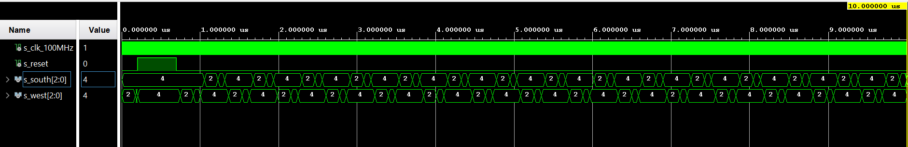

## Cvičenie 7

# PREPARATION TASKS

| **Input P** | `0` | `0` | `1` | `1` | `0` | `1` | `0` | `1` | `1` | `1` | `1` | `0` | `0` | `1` | `1` | `1` |
| :-- | :-: | :-: | :-: | :-: | :-: | :-: | :-: | :-: | :-: | :-: | :-: | :-: | :-: | :-: | :-: | :-: |
| **Clock** |  |  |  |  |  |  |  |  |  |  |  |  |  |  |  |  |
| **State** | A | A | B | C | A | B | A | B | C | D | B | A | A | B | C | D |
| **Output R** | `0` | `0` | `0` | `0` | `0` | `0` | `0` | `0` | `0` | `1` | `0` | `0` | `0` | `0` | `0` | `1` |

| **RGB LED** | **Artix-7 pin names** | **Red** | **Yellow** | **Green** |
| :-: | :-: | :-: | :-: | :-: |
| LD16 | N15, M16, R12 | `1,0,0` | `1,1,0` | `0,1,0` |
| LD17 | N16, R11, G14 | `1,0,0` | `1,1,0` | `0,1,0` |


# TRAFFIC LIGHT CONTROLLER VHDL SOURCE - p_traffic_fsm process

```vhdl

```

# TRAFFIC LIGHT CONTROLLER VHDL SOURCE - p_output_fsm process

```vhdl

```



# SMART CONTROLLER - STATE TABLE


# SMART CONTROLLER - STATE DIAGRAM


# SMART CONTROLLER VHDL SOURCE - p_smart_traffic_fsm process

```vhdl

```